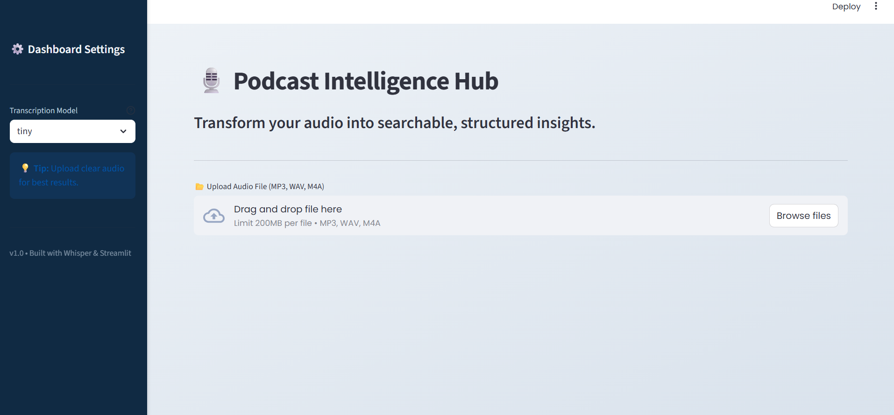
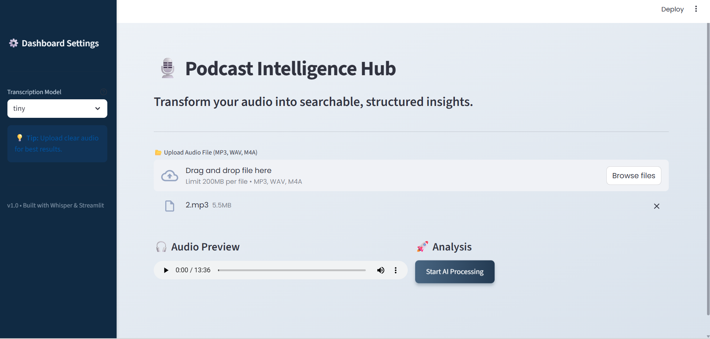
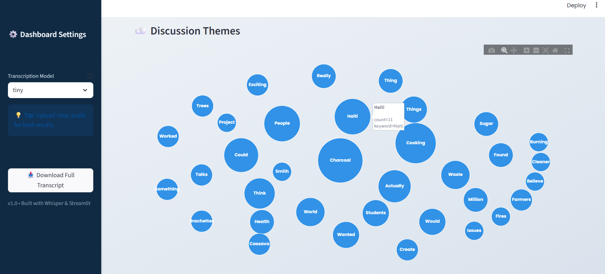
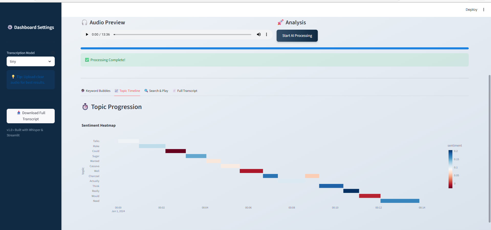
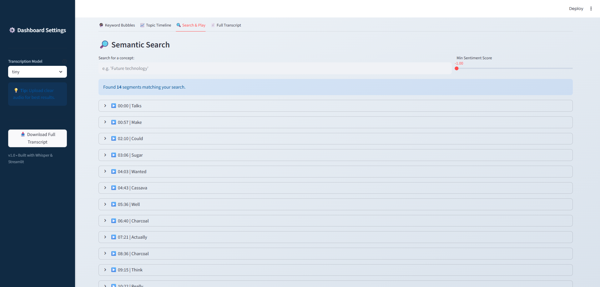
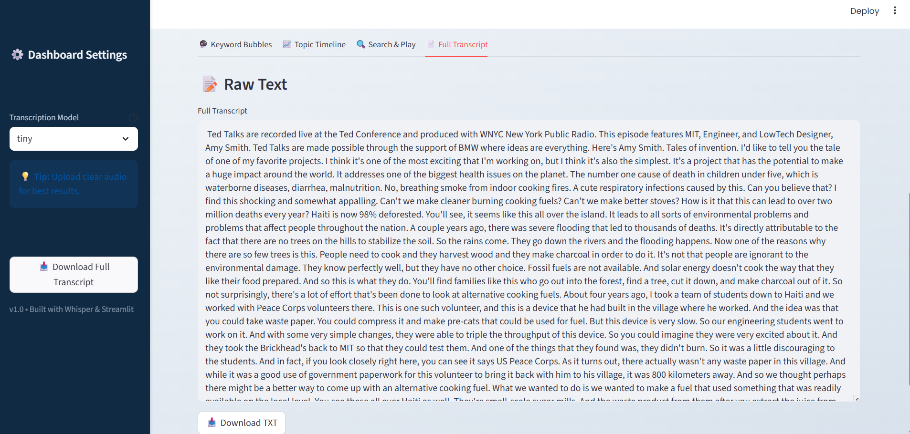

# Automated Podcast Transcription & Topic Segmentation

This project implements an AI-powered system to automatically transcribe podcast audio files and segment them into meaningful topical sections. It combines speech-to-text technology with natural language processing to help users navigate long audio content efficiently.

---

## 1. Project Overview

Podcasts and long-form audio recordings often span several hours, making it difficult to locate specific discussions. This system addresses this problem by converting audio into text, identifying topic boundaries, extracting keywords, and presenting the results through an interactive user interface.

### Objectives

* **Convert** podcast audio into text using advanced speech-to-text models.
* **Preprocess** audio (VAD & normalization) for improved transcription quality.
* **Segment** transcripts based on semantic topic changes.
* **Extract** keywords and generate summaries for each topic segment.
* **Provide** a seamless user interface for browsing, searching, and playback.

---

## 2. Project Structure

```text
Automated-Podcast-Transcription-and-Topic-Segmentation/
│── audio_raw/              # Storage for original uploaded audio files
│── audio_processed/        # Cleaned and normalized audio (WAV format)
│── data/                   # Data storage and CSV databases
│   ├── clean_project_dataset_sorted.csv  # Cleaned dataset sorted by key metrics
│   ├── clean_transcripts.csv             # Raw clean transcripts
│   ├── final_project_dataset_sorted.csv  # Final processed dataset ready for analysis
│   ├── final_search_index_fixed.csv      # Main search index used by the App
│── src/                    # Main source code modules
│   ├── preprocessing.py    # Audio cleaning, VAD, and normalization
│   ├── transcription.py    # Whisper AI speech-to-text pipeline
│   ├── segmentation.py     # Topic segmentation logic
│   ├── summarization.py    # Text summarization (BART/Transformers)
│   ├── keyword_extraction.py # Keyword extraction (YAKE/NLTK)
│   ├── ui_app.py           # Streamlit user interface (Main Entry Point)
│── tests/                  # Testing and Validation
│   ├── measure_accuracy.py # Tool to benchmark model performance
│   ├── test_pipeline.py    # Unit tests for pipeline logic
│── assets/                 # Storage for README screenshots
│── requirements.txt        # Python dependencies
│── README.md               # Project documentation
│── .env                    # Environment variables (Configuration)

```

---

## 3. Technology Stack

**Programming Language**

* Python 3.9+

**Speech-to-Text**

* **OpenAI Whisper:** State-of-the-art automatic speech recognition (ASR).
* **Faster Whisper:** Optimized inference for faster processing.

**Audio Processing**

* **Silero VAD:** Voice Activity Detection to remove silence and background noise.
* **Librosa / SoundFile:** For audio signal processing and I/O.
* **PyTorch:** Deep learning framework backend.

**Natural Language Processing**

* **NLTK:** Tokenization and text processing.
* **Transformers (Hugging Face):** For abstractive summarization (BART/T5).
* **Scikit-learn:** For semantic analysis and clustering.
* **KeyBERT / YAKE:** For keyword extraction.

**Visualization and UI**

* **Streamlit:** Interactive web dashboard creation.
* **Pandas:** Data manipulation and management.

---

## 4. Workflow

1. **Audio Ingestion:** Audio ingestion from local files or uploads via the interface.
2. **Audio Preprocessing:** Includes noise reduction and normalization using VAD.
3. **Transcription:** Transcription using speech-to-text models (Whisper).
4. **Topic Segmentation:** Segmentation based on semantic similarity and pauses.
5. **Keyword Extraction:** Keyword extraction and summarization for each segment.
6. **Visualization:** Visualization and browsing using a web interface.

---

## User Interface & Features

### 1. System Interface: Input Layer
The main dashboard featuring model selection (Tiny/Base) and drag-and-drop file upload functionality.




---

### 2. Data Ingestion & Verification
Integrated audio player allowing users to verify file integrity before initiating the AI pipeline.

 
---

### 3. NLP Insights: Keyword Visualization
A dynamic visualization where bubble size represents keyword frequency, utilizing a collision-free packing algorithm.



---

### 4. Results: Sentiment Analysis & Topic Flow
A Gantt-style timeline tracking topic shifts over time, color-coded by sentiment polarity (Red=Negative, Green=Positive).


---

### 5. User Features: Search & Retrieval
Advanced search interface allowing users to filter specific podcast segments by keyword and sentiment score.


---

### 6. Core Deliverable: High-Fidelity Transcription
Complete generated text output with one-click options to download the transcript as a text file.


---

## 6. How to Run the Project

### 1. Setup Environment

Clone the repository and install the required dependencies:

```bash
git clone [https://github.com/springboardmentor13579x-proj/Automated-Podcast-Transcription-and-Topic-Segmentation.git](https://github.com/springboardmentor13579x-proj/Automated-Podcast-Transcription-and-Topic-Segmentation.git)
cd Automated-Podcast-Transcription-and-Topic-Segmentation
pip install -r requirements.txt

```

### 2. Run the Application

Launch the interactive dashboard using Streamlit:

```bash
streamlit run src/ui_app.py

```

### 3. Usage

* Open your browser to the local URL provided (usually `http://localhost:8501`).
* Upload an audio file to start the pipeline.
* Use the search interface to find specific topics and play audio segments.

---

## 7. Testing

The project includes an automated testing suite to ensure reliability.

**Running Tests:**

```bash
python -m pytest

```

* **Scope:** Validates audio preprocessing logic, error handling for missing files, and the accuracy of keyword extraction algorithms.

---

<<<<<<< HEAD
## 8. Troubleshooting

* **Error: `FileNotFoundError: [WinError 2] The system cannot find the file specified**`
* **Cause:** FFmpeg is not installed or it is not added to your system PATH.
* **Fix:** Install FFmpeg and restart your terminal.

=======
>>>>>>> 4586488d0567618656ca3a92fe2fcbdf5578d3f2

* **App crashes with "Out of Memory"**
* **Cause:** The Whisper model (defaulting to "medium") is too large for your available RAM.
* **Fix:** Open `src/transcription.py` and change the line `model_size="medium"` to `model_size="tiny"` or `model_size="base"`.


* **Error: `Streamlit command not found**`
* **Cause:** The virtual environment is not currently activated.
* **Fix:** Activate your environment before running the command:
* **Windows:** `.venv\Scripts\activate`
* **Mac/Linux:** `source .venv/bin/activate`


