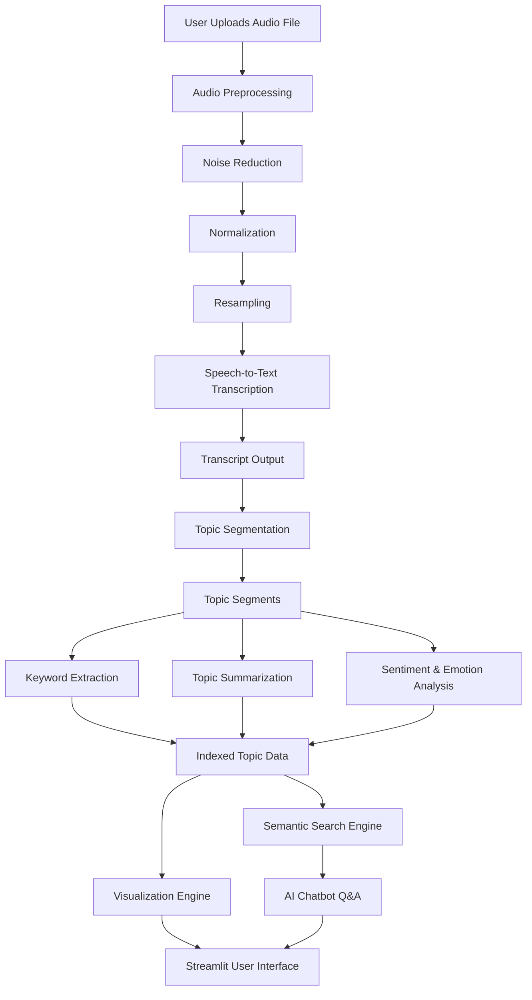

# Podcast Intelligence – Automated Audio Transcription and Topic Segmentation

## Overview
This is an end-to-end AI system that processes long audio or podcast files and converts them into structured, searchable intelligence. The system performs audio preprocessing, speech-to-text transcription, semantic topic segmentation, summarization, keyword extraction, sentiment and emotion analysis, and provides an interactive Streamlit-based user interface with semantic search and an AI chatbot.

The goal is to help users quickly understand and navigate long conversations without listening to the entire audio.

## Key Features
- **Automated Audio Preprocessing**: Converts and optimizes audio files for processing.
- **High-Fidelity Transcription**: Utilizes Whisper and Faster-Whisper for accurate speech-to-text conversion.
- **Semantic Topic Segmentation**: Segments transcripts into coherent topics using Sentence Transformers.
- **Content Summarization**: Generates concise summaries for each segmented topic.
- **Keyword Extraction**: Identifies key terms using KeyBERT and YAKE.
- **Sentiment & Emotion Analysis**: Analyzes the emotional tone of the conversation.
- **Interactive User Interface**: Provides a dashboard for visualizing insights and navigating audio.
- **AI Chatbot & Semantic Search**: Enables users to query the content and find specific topics contextually.

## System Workflow
1. **Input**: User uploads an audio file (MP3, WAV, etc.).
2. **Preprocessing**: The system standardizes the audio format and handles chunking if necessary.
3. **Transcription**: The audio is transcribed into text with timestamps using Whisper models.
4. **Segmentation**: The transcript is divided into semantically coherent segments based on topic shifts.
5. **Analysis**: Each segment undergoes summarization, keyword extraction, and sentiment analysis.
6. **Indexing**: Processed data is indexed for fast retrieval and semantic search.
7. **Visualization**: Results are displayed in the Streamlit UI, allowing users to explore the data interactively.
## Workflow Diagram



## Technology Stack
- **Programming Language**: Python
- **Audio Processing**: Librosa, PyDub
- **Speech-to-Text**: Whisper, Faster-Whisper
- **Natural Language Processing**: Sentence Transformers, Hugging Face Transformers, KeyBERT, YAKE
- **Visualization and UI**: Streamlit, Plotly, Pandas

## Project Structure
```text
project/
│── audio_raw/
│── audio_processed/
│── transcripts/
│── segments/
│── src/
│   ├── preprocessing.py
│   ├── transcription.py
│   ├── segmentation.py
│   ├── summarization.py
│   ├── keyword_extraction.py
│   ├── sentiment_analysis.py
│   ├── indexing.py
│   ├── chatbot.py
│   ├── logger.py
│   ├── ui_app.py
│── tests/
│── README.md
│── requirements.txt
│── LICENSE
```

## How to Run the Project

### Prerequisites
- Python 3.8 or higher installed on your system.
- FFmpeg installed and added to the system PATH (required for audio processing).

### Installation
1. Clone the repository or download the project files.
2. Navigate to the project directory.
3. Install the required Python dependencies:
   ```bash
   pip install -r requirements.txt
   ```

### Run Command
Launch the application using Streamlit:
```bash
python -m streamlit run src/ui_app.py
```

## Application Walkthrough
1. **Upload**: Use the sidebar to upload a podcast or audio file.
2. **Process**: Click the "Process Audio" button to trigger the pipeline.
3. **View Transcripts**: Read the full text or navigate through segmented topics.
4. **Analyze**: Explore visualizations for sentiment and identified keywords.
5. **Search**: Use the semantic search bar to find specific concepts within the audio.
6. **Chat**: Interact with the AI chatbot to ask questions about the podcast content.

## Advanced Capabilities
- **Semantic Search**: unlike simple keyword matching, the system understands the context of queries to find relevant segments.
- **Context-Aware Chatbot**: The built-in assistant uses the processed transcript as a knowledge base to answer user queries accurately.
- **Dynamic Segmentation**: Adjusts topic boundaries based on semantic similarity rather than fixed time intervals.

## Use Cases
- **Podcast Listeners**: Quickly grasp the main points of long episodes.
- **Researchers**: analyze interviews and focus group recordings.
- **Content Creators**: Extract clips and generate show notes automatically.
- **Students**: Review lecture recordings and find specific explanations.

## Limitations
- **Processing Time**: High-quality transcription and segmentation can be computationally intensive and time-consuming for very long files without GPU acceleration.
- **Model Size**: The system requires downloading several large pre-trained models (Whisper, Sentence Transformers) on the first run.

## Future Enhancements
- **Speaker Diarization**: Distinguishing between different speakers in the transcript.
- **Real-time Processing**: Streaming audio transcription and analysis.
- **Multi-language Support**: Expanding support for non-English audio content.

## License
This project is licensed under the MIT License. See the [LICENSE](LICENSE) file for more details.
