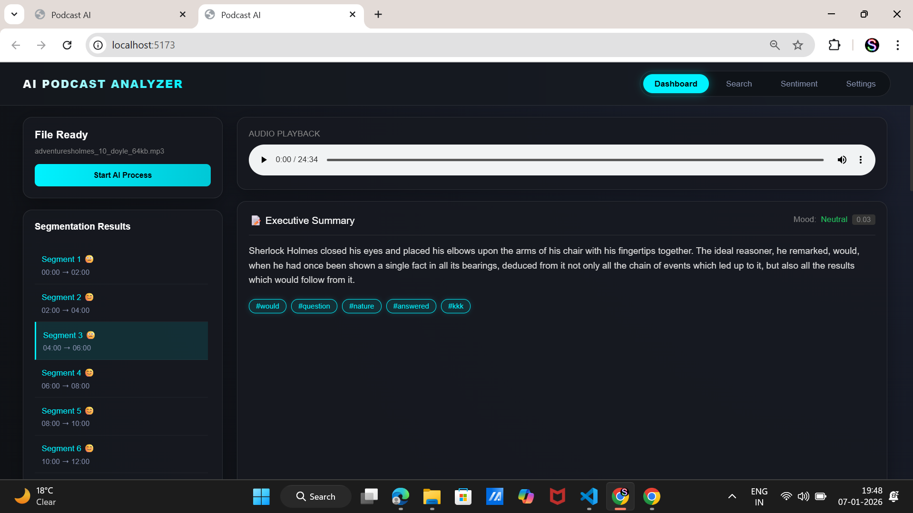
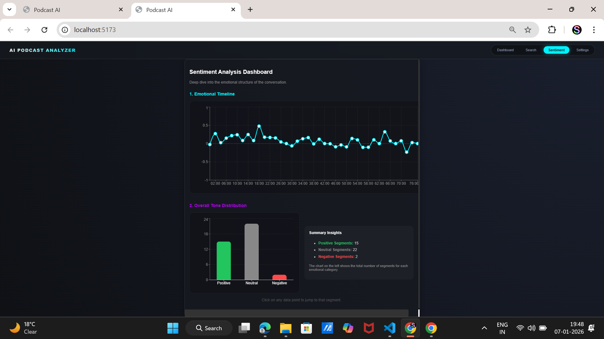

# 🎙️ Automated Podcast Transcription & Topic Segmentation


A comprehensive AI-powered tool designed to process long-form audio content. This application automatically transcribes podcasts, segments them into coherent topics, analyzes the emotional tone of each segment, and provides a searchable knowledge base.

Developed during the **Infosys Springboard Internship (Week 7 Milestone)**.


##  Screenshots

### 1. Main Dashboard (Transcription & Segmentation)

*View real-time transcription and topic breakdown.*

### 2. Sentiment Analysis Visualization

*Interactive timeline showing the emotional arc of the conversation.*

---
##  Approach

The solution follows a modular "Upload-Process-Visualize" workflow:

1. **Ingestion:** The user uploads an audio file (`.mp3` or `.wav`) via the React frontend.
2. **Preprocessing:** The Python backend receives the file, validates the format, and uses `Librosa`/`Pydub` to calculate duration and prepare the audio for processing.
3. **AI Analysis:**
* **Transcription:** The audio is converted to text using an automated speech-to-text model.
* **Segmentation:** The text is analyzed using Natural Language Processing (NLP) techniques (TF-IDF vectorization and clustering) to detect topic shifts and break the transcript into logical segments.
* **Sentiment Analysis:** Each segment is analyzed using VADER (Valence Aware Dictionary and sEntiment Reasoner) to determine the emotional tone (Positive, Negative, or Neutral).

##  Key Features

* **Multi-Format Support:** Drag-and-drop support for `.mp3` and `.wav` files with server-side validation.
* **Automated Transcription:** Converts speech to text with high accuracy using AI models.
* **Intelligent Segmentation:** Breaks down long audio into logical "Topics" based on context, not just silence.
* **Sentiment Visualization:** * **Emotional Timeline:** Interactive Line Chart to visualize tone changes over time.
    * **Tone Distribution:** Bar Chart summary (Positive vs. Negative vs. Neutral).
* **Global Search:** Instantly find specific keywords or topics across the entire episode.
* **Interactive Playback:** Click on any sentiment point or transcript segment to jump the audio player to that exact second.


##  Tech Stack

### **Frontend**
* **React.js (Vite):** Core framework for a fast, responsive UI.
* **Recharts:** For data visualization (Sentiment Line & Bar charts).
* **CSS Modules:** For modular and clean styling.

### **Backend**
* **Python (Flask):** REST API to handle file uploads and processing.
* **Pydub / Librosa:** For audio manipulation and duration calculation.
* **VADER Sentiment:** For rule-based sentiment scoring.
* **Scikit-learn:** For text clustering and topic segmentation logic.


##  Installation & Setup

Follow these steps to run the project locally.

### **Prerequisites**
* Python 3.9+
* Node.js & npm

### **1. Clone the Repository**
```bash
git clone [https://github.com/springboardmentor13579x-proj/Automated-Podcast-Transcription-and-Topic-Segmentation.git](https://github.com/springboardmentor13579x-proj/Automated-Podcast-Transcription-and-Topic-Segmentation.git)
cd Automated-Podcast-Transcription-and-Topic-Segmentation


# Backend Setup(Python)
cd server
# Create a virtual environment (Optional but recommended)
python -m venv venv
# Windows: venv\Scripts\activate
# Mac/Linux: source venv/bin/activate

# Install requirements
pip install -r requirements.txt

# Start the Server
python server.py

# Frontend Setup(React)
cd client
npm install
npm run dev
```

